# RFM Pipeline & Viewer

這個系統解決「分析大量交易 CSV 既耗時又容易出錯」的痛點：使用者只要把檔案交給前端，上傳後端，即可自動觸發 Stage 1–6 的資料處理、把產出的 CSV/模型匯入 MySQL，最後 Viewer 能用 API 或資料庫呈現結果。整個流程完全依照專案現有程式運作，沒有任何手動搬檔。

---

## 1. 專案簡介（白話、簡短）
- **它是什麼？** 一套自助式 RFM/Pipeline 平台，讓商務使用者把原始銷售明細 CSV 丟進來，就能得到乾淨資料、產品/顧客分群與模型評估結果。
- **核心流程**：Upload.jsx 上傳 CSV → backend/server.py 接收並觸發 `data_layer/pipeline.py` → Stage 1–6 生成 artifacts → `database/import_artifacts_to_db.py` 自動匯入 MySQL → Viewer（React）可直接顯示結果或透過 API 讀資料庫。

---

## 2. 一張圖秒懂
```mermaid
flowchart LR
    A[前端 Upload.jsx<br/>上傳 CSV] -->|POST /upload| B[FastAPI backend/server.py]
    B --> C[pipeline.py 執行 Stage 1–6]
    C --> D[Artifacts (CSV/JSON/PKL)]
    D --> E[import_artifacts_to_db.py 匯入 MySQL]
    E --> F[Viewer.jsx / API 顯示洞察]
```

---

## 3. Pipeline 詳細流程圖

```mermaid
flowchart LR
    U[上傳 data_layer/uploads/data.csv] --> S1[Stage 1 清洗<br/>stage1.py]
    S1 --> S2[Stage 2 取消訂單處理<br/>stage2_explore_data.py]
    S2 --> S3[Stage 3 產品分群<br/>stage3.py]
    S3 --> S4[Stage 4 客戶分層<br/>stage4_customer_segmentation.py]
    S4 --> S5[Stage 5 多模型分類<br/>stage5_classification.py]
    S5 --> S6[Stage 6 測試預測<br/>stage6_testing_predictions.py]
    S6 --> S7[Stage 7 匯入 MySQL<br/>import_artifacts_to_db.py]
    S7 --> V[Viewer/其他 API 使用資料]
```


---

## 4. 專案資料夾結構
| 資料夾 / 檔案 | 用途 |
|---------------|------|
| `backend/` | FastAPI 入口。`server.py` 提供 `POST /upload`、儲存檔案並呼叫 pipeline。 |
| `data_layer/` | 全部 Stage 腳本與 artifacts/ uploads/ 資料夾。`pipeline.py` 串 Stage 1–6 + Stage 7。 |
| `database/` | SQLAlchemy 設定與資料匯入工具。`db_init.py` 讀 `.env` 建 engine、`import_artifacts_to_db.py` 將 artifacts 自動建表與匯入。 |
| `frontend/` | Vite + React App。`src/pages/Upload.jsx` 供上傳進度、`src/pages/Viewer*.jsx` 顯示洞察。 |
| `.env` | 存放 `DATA_DB_URL` 及可選的 `MAX_UPLOAD_MB`，由 `db_init.py` 自動載入。 |

> 其他關鍵檔案：`frontend/src/App.jsx` 控制上傳頁與 Viewer 切換、`frontend/src/pages/Viewer.jsx` 目前展示靜態 mock 資料，未來可改讀 MySQL。

---

## 5. 逐步流程解說
### 前端如何上傳
- `Upload.jsx` 讀 `VITE_API_BASE_URL`（預設 `http://localhost:8000`），並限制檔案大小不超過 `MAX_UPLOAD_MB`（前端與後端都會檢查）。
- 成功送出表單後顯示 Stage 1–6 的動態進度，任何 Stage 失敗會把錯誤訊息（HTTP detail 或 stdout/stderr）顯示給使用者。

### backend/server.py 如何接收
1. `POST /upload` 以串流方式寫入 `data_layer/uploads/data.csv`，確保不超過 `MAX_UPLOAD_MB`。
2. 檔案寫完後透過 `run_in_threadpool` 呼叫 `pipeline.run_all_stages(stop_on_error=False)`。
3. 將每個 Stage 的狀態、耗時、summary/stdout/stderr 以及匯入 DB 的結果組成 JSON 回傳前端。

### pipeline.py 如何串 Stage 1–6
- Stage 1 以函式呼叫（內存 `stage1.run_stage()`），其餘 Stage 2–6 使用 `subprocess.run([sys.executable, script])` 逐一執行並記錄輸出。
- `_primary_stages_completed` 用來確認 Stage 1–6 全部成功，再進一步執行 Stage 7 匯入 DB。

<details>
<summary>Stage 1–6 技術細節（展開閱讀）</summary>

- **Stage 1（`stage1.py`）**：讀 `uploads/data.csv`，強制 `CustomerID` 和 `InvoiceID` 為字串、轉換 `InvoiceDate`、丟掉缺少 `CustomerID` 的列、移除重複，輸出 `artifacts/stage1_df_initial_clean.csv` 並記錄重複數。
- **Stage 2（`stage2_explore_data.py`）**：複製資料並找出負數 Quantity 的訂單，透過 `CustomerID + StockCode` 配對最近的正數交易，推算 `QuantityCanceled`，重新計算 `TotalPrice`，輸出 `stage2_df_cleaned.csv` 與 `stage2_liste_produits.csv`。
- **Stage 3（`stage3.py`）**：使用 NLTK 取得商品描述關鍵字、建立 one-hot + 價格 bucket 特徵，持續調整 KMeans(k=5) 直到 silhouette ≧ 0.145，輸出 `stage3_desc_to_prod_cluster.csv` 以及多個 `.pkl/.npy` 模型檔案。
- **Stage 4（`stage4_customer_segmentation.py`）**：把 Stage 3 的產品群寫回交易資料，計算每張發票的 Basket KPI，依 2011-10-01 切 Train/Test，為每位顧客算出 `count/min/max/mean` 及各產品群百分比，再以 StandardScaler + KMeans(11) 進行客戶分群，輸出 `stage4_selected_customers_train.csv` 等檔。
- **Stage 5（`stage5_classification.py`）**：針對 Stage 4 的 `cluster` 目標執行多種分類器（SVC、LR、KNN、Decision Tree、Random Forest、AdaBoost、Gradient Boosting），每個模型用 GridSearchCV 調參，存下最佳 estimator 到 `artifacts/objects/`，並建立 RF+GB+KNN 的 VotingClassifier，輸出 `stage5_eval.json` 與 `stage5_pred_proba.csv`。
- **Stage 6（`stage6_testing_predictions.py`）**：使用 Stage 4 的測試集建特徵矩陣，載回 Stage 5 儲存的模型，計算每個模型在測試集的 accuracy、預測結果及機率分佈，輸出 `stage6_eval.json`、`stage6_predictions.csv`、`stage6_pred_proba.csv`。

</details>

### Stage 7 如何匯入 MySQL
- `database/import_artifacts_to_db.py` 被 pipeline 視為 Stage 7，只有 Stage 1–6 都成功才會被呼叫。
- 腳本會掃描 `data_layer/artifacts/` 下的所有 CSV/XLS/XLSX 檔，透過 `infer_schema()` 判斷欄位型別並建立（或重新建立）對應的 MySQL 資料表，再用 `to_sql(..., method="multi")` 批次寫入。
- `db_init.py` 會自動載入最近的 `.env` 並建立 engine，所以只要 `DATA_DB_URL` 正確，就能無縫匯入。

---

## 6. 安裝與執行（10 步驟快走法）
1. **定位專案**：`cd RFM`（假設你已把 repo 下載到本機）。
2. **建立虛擬環境**：`python -m venv .venv`
3. **啟用虛擬環境**：Windows PowerShell 執行 `.venv\Scripts\Activate.ps1`
4. **安裝 Python 套件**：
   ```bash
   pip install fastapi uvicorn pandas numpy scikit-learn nltk joblib sqlalchemy pymysql openpyxl
   ```
5. **下載 Stage 3 需要的 NLTK 資料**：
   ```bash
   python - <<'PY'
   import nltk
   for pkg in ("punkt", "averaged_perceptron_tagger"):
       try:
           nltk.data.find(("tokenizers/" if pkg=="punkt" else "taggers/") + pkg)
       except LookupError:
           nltk.download(pkg)
   PY
   ```
6. **建立 `.env`**：在 `RFM/.env` 內填入  
   ```
   DATA_DB_URL=mysql+pymysql://<user>:<password>@localhost:3306/<database>
   MAX_UPLOAD_MB=100  # 可省略，預設 100MB
   ```
7. **啟動後端**：`uvicorn backend.server:app --reload --port 8000`
8. **啟動前端**：
   ```bash
   cd frontend
   npm install
   npm run dev   # 預設 http://localhost:5173
   ```
9. **（可選）手動跑整條 pipeline**：
   ```bash
   cd RFM
   python - <<'PY'
   from data_layer.pipeline import run_all_stages
   print(run_all_stages(stop_on_error=False))
   PY
   ```
10. **（可選）僅重新匯入 artifacts 到 MySQL**：`python -m database.import_artifacts_to_db --folder data_layer/artifacts`  
    > 一般上傳流程已自動執行 Stage 7，只有你想重建資料庫或驗證 schema 時才需要手動跑。

---

## 7. API 回傳範例
```json
{
  "message": "上傳成功",
  "saved_as": "data.csv",
  "original_filename": "sales_2024.csv",
  "size": 45580638,
  "max_upload_mb": 100,
  "pipeline_results": [
    {
      "stage": "Stage 1",
      "status": "ok",
      "summary": {
        "duplicate_rows": 526,
        "rows": 490000,
        "cols": 8,
        "artifacts_file": "data_layer/artifacts/stage1_df_initial_clean.csv"
      },
      "duration_sec": 8.412
    },
    {
      "stage": "Stage 2",
      "status": "ok",
      "stdout": "[Stage 2] Saved: artifacts/stage2_df_cleaned.csv...",
      "stderr": "",
      "duration_sec": 54.782
    },
    {
      "stage": "Stage 7 - Import to DB",
      "status": "ok",
      "imported_tables": ["stage1_df_initial_clean", "stage6_predictions", "stage6_pred_proba"],
      "duration_sec": 20.101
    }
  ],
  "pipeline_total_seconds": 210.345
}
```

---

## 8. 資料庫匯入後的表格示例
- **`stage4_selected_customers_train`**（由 Stage 4 輸出）  
  | 欄位 | 說明 |
  |------|------|
  | `CustomerID` | 顧客 ID（字串） |
  | `count`, `min`, `max`, `mean`, `sum` | 該顧客 basket 金額統計 |
  | `categ_0`~`categ_4` | 各產品群消費占比（百分比） |
  | `cluster` | Stage 4 KMeans 指派的群組 |

- **`stage6_predictions`**（由 Stage 6 匯入）  
  | 欄位 | 說明 |
  |------|------|
  | `model` | 模型名稱（Support Vector Machine、Random Forest 等） |
  | `CustomerID` | 測試集中被預測的顧客 |
  | `y_true` | 以 Stage 4 KMeans 得到的真實群組 |
  | `y_pred` | 各模型預測的群組 |

所有表格都自動由 Stage 7 依檔名正規化（小寫、底線）後建立。

---

## 9. 常見錯誤排查
- **`ModuleNotFoundError: No module named 'backend.server'`**：在啟動 `uvicorn` 時，請先 `cd RFM`，確保工作目錄包含 backend 模組。
- **`.env 沒被讀到`**：`db_init.py` 會往上層尋找最近的 `.env`，請把檔案放在 `RFM/.env`，確保 `DATA_DB_URL` 存在。
- **MySQL 無法連線或匯入失敗**：檢查 `DATA_DB_URL` 帳密/port/database 是否正確，並確保資料庫已建立，使用的帳號具備 `CREATE/DROP TABLE` 權限。
- **缺少 NLTK 資料**：Stage 3 需要 `punkt` 與 `averaged_perceptron_tagger`，請重新執行 README 的 NLTK 下載程式碼。
- **資料庫 DROP TABLE 權限不足**：Stage 7 會重建表格，若帳號沒有刪除權限會失敗；請改用具權限的帳號或手動調整腳本。
- **上傳檔案超過 `MAX_UPLOAD_MB`**：前後端都會拒收超過限制的檔案，可在 `.env` 設定更大的 `MAX_UPLOAD_MB` 或先拆分檔案。

---

## 10. 未來擴充方向
1. **Viewer API 化**：新增查詢 API（例如 `GET /reports/latest`）讓 Viewer.jsx 直接讀 MySQL，而不是使用內建 mock data。
2. **自動排程**：以 cron、Celery 或其他排程器定期觸發 pipeline，不再仰賴人工上傳。
3. **登入/權限管理**：為 Upload 介面與 Viewer 加上身份驗證與角色權限，保護資料。
4. **整合 AutoML**：在 Stage 5/6 引入 AutoML 或 AutoSklearn，提高模型探索速度並把結果寫入 artifacts。
5. **加強資料庫 schema**：針對常用查詢設計實體-關聯 schema、加索引、建立視圖，讓 Viewer 與其他服務能更有效讀取。

---

照著以上說明即可跑通「上傳 CSV → 自動 pipeline → 匯入 DB → Viewer 顯示」的完整體驗，也能快速找到每個程式入口並著手擴充。
